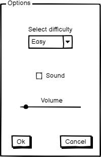
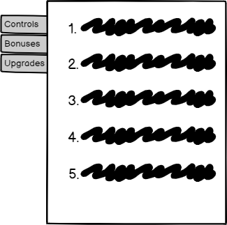
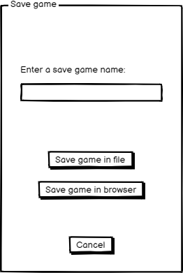
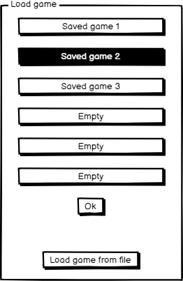
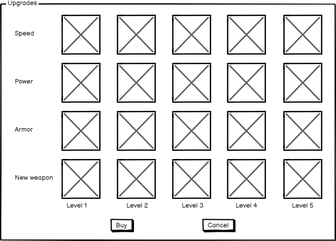

# Требования к игре Galaxy Invaders
## Содержание
1. [Введение](#introduction)
2. [Требования пользователя](#user-requirements) 
  2.1. [Программные интерфейсы](#programming-interfaces) 
  2.2. [Интерфейс пользователя](#user-interface) 
  2.3. [Характеристики пользователей](#user-characteristics)
3. [Системные требования](#system-requirements) 
  3.1. [Функциональные требования](#functional-requirements) 
  3.2. [Нефункциональные требования](#non-functional-requirements) 
  3.3. [Ограничения](#limitations) 
4. [Описание игры](#game-description) 
  4.1. [Цель игры](#game-goal) 
  4.2. [Правила игры](#game-rules) 
5. [Аналоги](#analogs) 

## 1. Введение 
Данная игра относится к жанру Shoot 'em up, который является подвидом жанра shooter.
В этих играх игровой персонаж продвигается вперёд автоматически и часто представляет собой 
летающее транспортное средство типа воздушного судна или космического аппарата, которое 
расстреливает множество врагов, одновременно уворачиваясь от препятствий. Кроме того, игры 
в этом жанре известны требовательностью к реакции игрока, а также необходимостью запоминать 
игровые уровни и последовательности вражеских атак.

Galaxy Invaders - это игра в которой игрок управляет космическим кораблем и сражается
с инопланетными захватчиками, зарабатывая очки и подбирая бонусы для усиления способностей
своего корабля.

## 2. Требования пользователя

### 2.1. Программные интерфейсы
Игра использует WebGL (Web Graphics Library) - кроссплатформенный API предназначенный для 
визуализации интерактивной 3D и 2D графики в пределах совместимости веб-браузера без использования 
плагинов. WebGL построен на основе OpenGL ES 2.0 и позволяет создавать и показывать графические
компоненты через Canvas в HTML5.

Для работы со звуком используется Web audio API - высокоуровневый JavaScript API для обработки и 
синтеза звука в веб-приложениях. Этот API был специально разработан для модульной маршрутизации. 
Основные операции со звуком представляют собой узлы (audio nodes), связанные между собой и формирующие 
схему маршрутизации (audio routing graph). Несколько источников — с разными типами каналов — обрабатываются
внутри единого контекста. Такая модульная схема обеспечивает необходимую гибкость для создания 
сложных функций с динамическими эффектами.

Для сохранения и загрузки игр используется Web Storage API - механизм, при помощи которого браузер
может безопасно хранить пары ключей/значениий.

### 2.2. Интерфейс пользователя
- Экран игры

В верхней части окна с игрой пользователь видит текущие очки, номер уровня, количество денег, сколько у него осталось жизней 
и сколько брони осталось у его космического корабля. 
Под игровым полем находится ряд кнопок с помощью которых пользователь может совершить следующие действия: начать новую игру, 
открыть меню настроек, посмотреть правила игры, сохранить/загрузить игру и открыть меню покупки улучшений для 
космического корабля.

- Меню настроек

В меню настроек можно выбрать уровень сложности, а также включить и выключить звук или настроить его громкость.

- Игровые правила

В этом окне игрок сможет ознакомиться с правилами игры, переключаясь между разными расделами при помощи вкладок слева.

- Меню сохранения игры

В этом меню пользователь сможет выбрать как именно он хочет сохранить свой прогресс (в файл на диске или локально в браузере)

- Меню загрузки сохраненных игр

В этом меню игрок сможет выбрать одну из сохраненных в браузере игр или загрузить файл с сохранением с диска.

- Меню покупки улучшений

В этом меню игрок сможет улучшить свой космический корабль за деньги заработанные в сражениях. Есть возможность
увеличить скорость, защиту, силу или приобрести новое оружие для своего корабля.

### 2.3. Характеристики пользователей

- Целевая аудитория

Так как данная игра очень простая и принадлежит к одному из самых распространенных и популярных жанров (шутер), 
то подходит для любых категорий пользователей. 

## 3. Системные требования 

### 3.1. Функциональные требования
  
Пользователю должны быть предоставлены следующие возможности:
   1. Начать игру.
   2. Сохранить игру.
   3. Загрузить игру.
   4. Улучшать за деньги броню корабля.
   5. Улучшать за деньги скорость корабля.
   6. Улучшать за деньги силу выстрелов корабля.
   7. Покупать новое оружие для корабля. (Увеличивает количество снарядов и изменяет визульный эффект стрельбы) 
   8. Должна быть реализована возможность сражаться как с обычными противниками, так и с огромными боссами.
   8. Из враго должны выпадать деньги или бонусы (могут оказывать положительные или отрицательные эффекты) которые игрок может подбирать.
   8. Включать/выключать звук.
   10. Регулировать громкость звука.
   11. Менять уровень сложности.
   12. Игрок должен иметь возможность управлять кораблем как через клавиши WASD и открывать стрельбу нажимая клавишу shift.

### 3.2. Нефункциональные требования

- В игре должен быть интуитивно понятный геймплей 
- В игре должны использоваться достаточно красивые спецеффекты, но при этом она не должна тормозить или слишком сильно загружать
видеокарту или процессор у пользователей.
- Визуальный дизайн бонусов и денег выпадающих из противников, должен быть достаточно интуитивен и понятен любому игроку.
- Игра должна быть кроссбраузерной для того чтобы максимально увеличить аудиторию данного приложения.

### 3.3. Ограничения

Игру можно запустить только в веб браузере с поддержкой WebGL.

## 4. Описание игры

### 4.1. Цель игры
Пройти все уровни попутно сражаясь с противниками (для того чтобы пройти уровень нужно уничтожить всех противников), подбирая бонусы и улучшая свой корабль за деньги. В финале игроку предстоит победить в схватке финального босса. 

### 4.2. Правила игры

Игрок управляет космическим кораблем и может перемещаться как вправо, влево, назад, вперед так и по диагонали (зажав одновременно две клавиши).
Для победы в игре игроку предстоит победить сотни противников, среди которых будут встречаться как слабые (чьи корабли будут взрываться от одного попадания) так и 
практически неуязвимые боссы, обладающие значительной огневой мощью. За уничтожение противников игроку начисляются очки, при этом игрок получает значительно больше очков если он совсем недавно уже уничтожил другого противника или если ему удалось подеть босса за очень маленькое время (например 1 минуту).
Кроме того при уничтожении противников есть шанс что на их месте появится какой-нибудь бонус или деньги, которые могут быть подобраны игроком.
Выпавшие из противников вещи всегда находятся в движении и рано или поздно покидают игровое поле. Деньги могут быть использованы игроком для улучшения различных характеристик корабля.

## 5. Аналоги

У этой игры есть огромное количество аналогов начиная от старенького Space Invaders (1978) и заканчивая современными космическими шутерами, такими как например [Galaxy Shooter Attack 2020](https://www.amazon.co.uk/Galaxy-Shooter-Attack-2019-Space/dp/B07WDYXZ3M) (эта игра была выпущена для Android). Преимущества моей игры в том что она абсолютно бесплатна и не требует от игроков никакой дополнительной платы за возможность разблокировать новый контент или получение преимущества в бою.

