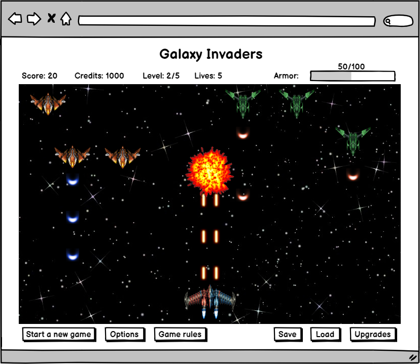

# Требования к игре Galaxy Invaders
## Содержание
1. [Введение](#introduction)
2. [Требования пользователя](#user-requirements) 
  2.1. [Программные интерфейсы](#programming-interfaces) 
  2.2. [Интерфейс пользователя](#user-interface)

## 1. Введение 
Данная игра относится к жанру Shoot 'em up, который является подвидом жанра shooter.
В этих играх игровой персонаж продвигается вперёд автоматически и часто представляет собой 
летающее транспортное средство типа воздушного судна или космического аппарата, которое 
расстреливает множество врагов, одновременно уворачиваясь от препятствий. Кроме того, игры 
в этом жанре известны требовательностью к реакции игрока, а также необходимостью запоминать 
игровые уровни и последовательности вражеских атак.

Galaxy Invaders - это игра в которой игрок управляет космическим кораблем и сражается
с инопланетными захватчиками, зарабатывая очки и подбирая бонусы для усиления способностей
своего корабля.

## 2. Требования пользователя

### 2.1. Программные интерфейсы
Игра использует WebGL (Web Graphics Library) - кроссплатформенный API предназначенный для 
визуализации интерактивной 3D и 2D графики в пределах совместимости веб-браузера без использования 
плагинов. WebGL построен на основе OpenGL ES 2.0 и позволяет создавать и показывать графические
компоненты через Canvas в HTML5.

Для работы со звуком используется Web audio API - высокоуровневый JavaScript API для обработки и 
синтеза звука в веб-приложениях. Этот API был специально разработан для модульной маршрутизации. 
Основные операции со звуком представляют собой узлы (audio nodes), связанные между собой и формирующие 
схему маршрутизации (audio routing graph). Несколько источников — с разными типами каналов — обрабатываются
внутри единого контекста. Такая модульная схема обеспечивает необходимую гибкость для создания 
сложных функций с динамическими эффектами.

Для сохранения и загрузки игр используется Web Storage API - механизм, при помощи которого браузер
может безопасно хранить пары ключей/значениий.

### 2.2. Интерфейс пользователя
- Экран игры

В верхней части окна с игрой пользователь видит текущие очки, номер уровня, количество денег, сколько у него осталось жизней 
и сколько брони осталось у его космического корабля. 
Под игровым полем находится ряд кнопок с помощью которых пользователь может совершить следующие действия: начать новую игру, 
открыть меню настроек, посмотреть правила игры, сохранить/загрузить игру и открыть меню покупки улучшений для 
космического корабля.

